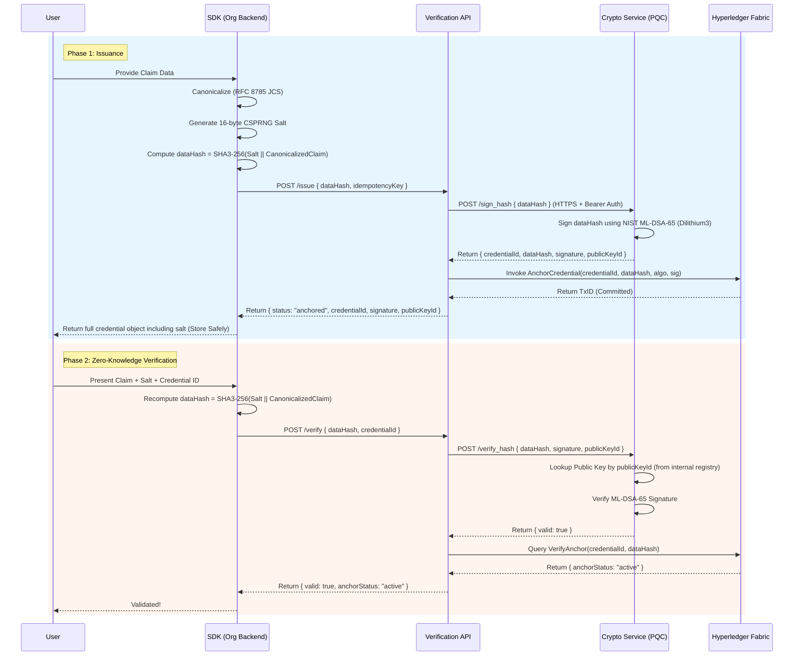

# ScatterID — Post-Quantum Identity Verification Infrastructure

[](https://github.com/0x4rc4n3/ScatterID-product/actions/workflows/ci.yml)
[](LICENSE)

ScatterID is a decentralized, zero-knowledge, post-quantum identity verification system.

## 🏛 Core Architectural Flow



---

## 🏛 Cryptographic Security Guarantees & Boundaries

### 1. Post-Quantum Signature Scheme (ML-DSA-65 / Dilithium3)
- **Standard**: NIST FIPS 204 Standard.
- **Security Category**: Category 3.
- **Security Property**: EUF-CMA.

### 2. Zero-Knowledge Hashing Model
- **Hashing Algorithm**: SHA3-256 over an RFC 8785 (JCS) canonicalized JSON payload, concatenated with a 16-byte CSPRNG Salt.
- **Data Retention Guarantee**: ScatterID NEVER stores raw claim data, salts, or any reconstructable fragments. It stores strictly the UUID, dataHash, signature, publicKeyId, and ledger anchor info.

### 3. Public Key Trust Boundary
- Verification exclusively resolves the issuer's public key from ScatterID's internal trusted key registry.

---

## 🔒 Inter-Service Network Security

1. **Bearer Token Authentication**:
   - `CRYPTO_SERVICE_API_KEY`: Every request to `crypto-service:5001` enforces TLS 1.3 encryption and Bearer Token header validation.
2. **HashiCorp Vault Key Management**:
   - Root keys are provisioned in HashiCorp Vault KV v2 secret engine.

---

## 📁 Repository Structure

```
ScatterID/
├── components/
│   ├── crypto/                 # PQC Engine & Zero-Knowledge ML-DSA Signer
│   ├── verification-api/       # Core Express Verification Gateway
│   ├── project-dashboard/      # Deep-Tech Operator Dashboard & Diagnostics Engine
│   └── blockchain/             # Hyperledger Fabric Go Chaincode & Mutual TLS Network
├── sdk/                        # TypeScript/JavaScript SDK for issuing and verifying credentials
├── docs/                       # Architectural & Technical Design Specifications
├── docker-compose.yml          # Multi-Container Topology Orchestration
├── test_all.sh                 # E2E Integration Test Suite
└── README.md                   # Master Architectural Documentation
```

---

## Current Limitations

ScatterID is an active research and development project. The following limitations are acknowledged honestly:

- **No independent security audit** has been performed. The codebase has undergone internal review but has not been evaluated by an external security firm.
- **Test coverage is smoke-level**, not comprehensive. Unit and integration tests exist for core flows, but full edge-case and failure-mode coverage is a work in progress.
- **The default `docker-compose.yml` configuration is for local development only** and is not hardened for production deployment. Vault runs in dev mode (`VAULT_DEV_MODE=true`) over HTTP, and TLS certificates are self-signed.
- **CI includes linting, tests, and build verification** but does not yet include SAST or comprehensive dependency scanning beyond `npm audit` / `pip-audit`.
- **Documentation reflects the current v2 zero-knowledge architecture**; supplementary docs in `docs/` may reference design decisions that predate the current implementation.

See [CHANGELOG.md](CHANGELOG.md) for the full history of changes and resolved issues.

---

## Security Note
**MANUAL REVIEW REQUIRED**: Any version bumps to cryptographic dependencies (`flask`, `hvac`, `liboqs-python`, and any `crypto` JS packages) require manual review of changelogs before upgrading. Do not use caret (`^`) or tilde (`~`) version ranges for these packages.

For reporting security vulnerabilities, see [SECURITY.md](SECURITY.md). For contributing, see [CONTRIBUTING.md](CONTRIBUTING.md).

