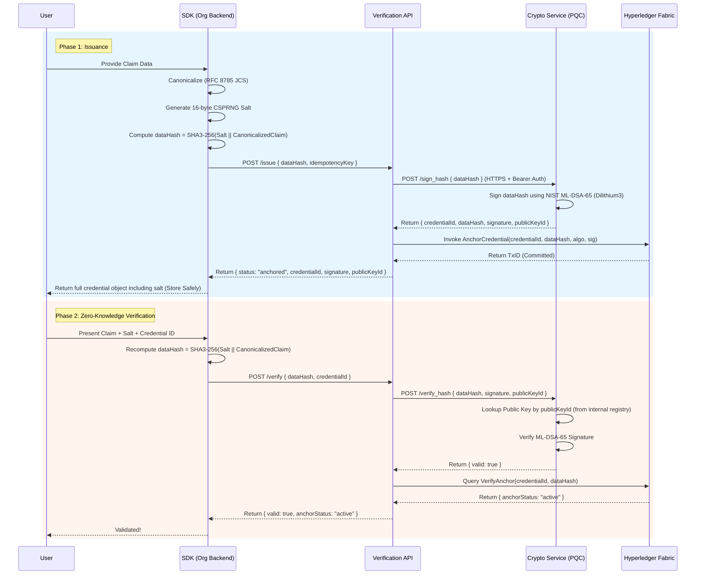

# ScatterID — Post-Quantum Identity Verification Infrastructure

[](https://github.com/0x4rc4n3/ScatterID-product/actions/workflows/ci.yml)
[](https://github.com/0x4rc4n3/ScatterID-product/actions/workflows/codeql.yml)
[](https://github.com/gitleaks/gitleaks)
[](LICENSE)

ScatterID is an open-source, post-quantum, zero-knowledge identity verification infrastructure combining NIST FIPS 204 (ML-DSA-65) digital signatures, RFC 8785 JSON canonicalization commitments, and Hyperledger Fabric blockchain anchoring.

---

## 📚 Master Documentation Hub

All architecture, cryptographic specifications, deployment runbooks, and compliance guides are organized in the central docs index:

👉 **[ScatterID Master Documentation Index](docs/README.md)**

---

## 🚀 Quickstart (Zero-to-Running in 60 Seconds)

ScatterID is runnable on any standard Linux or macOS host with Docker installed:

```bash
# 1. Clone the repository
git clone https://github.com/0x4rc4n3/ScatterID-product.git
cd ScatterID-product

# 2. Launch the turnkey stack (auto-provisions keys, certs, blockchain, and microservices)
./scripts/quickstart.sh

# Option: Start with the Web Operator Dashboard enabled:
./scripts/quickstart.sh --with-dashboard
```

### ⚙️ Run Modes: Backend-Only vs. Backend + Operator Dashboard
ScatterID supports Docker Compose profiles (`profiles: ["dashboard"]`) to match different operational use cases:

* **Core Backend Only (`./scripts/start.sh` or `docker compose up -d`):**
  Starts strictly the essential microservices (ML-DSA-65 Crypto Service, Verification API Gateway, Hyperledger Fabric ledger, HashiCorp Vault). Ideal for headless deployments or embedding ScatterID behind another service without exposing administrative console ports.
* **Full Stack with Dashboard (`./scripts/start.sh --with-dashboard` or `docker compose --profile dashboard up -d`):**
  Starts all core backend microservices PLUS the web-based Operator Diagnostics Console on port 4000.

---

### Active Endpoints Once Started:
- **Verification Gateway API:** `http://localhost:3000`
- **Post-Quantum Crypto Microservice (ML-DSA-65):** `https://localhost:5001`
- **HashiCorp Vault KMS:** `http://localhost:8200`
- **Operator Diagnostics Console:** `http://localhost:4000` *(when run with `--with-dashboard`)*
- **Visual SDK Playground Web App:** `http://localhost:5050` *(run via `cd examples/web-app && npm start`)*

### Verify the Stack with the E2E Test Suite:
```bash
./scripts/test_all.sh
```

---

## 🎮 Visual SDK Playground & Interactive Demo
ScatterID includes a dedicated graphical web app that connects directly to the TypeScript/JavaScript SDK:

```bash
cd examples/web-app && npm start
# Open http://localhost:5050 in your browser
```
- **Live 10-Preset Selector:** Load realistic sample claims across 10 industries (Medicine, Aviation, Cybersecurity, Legal, KYC).
- **Real-Time Cryptographic Telemetry:** Inspect local RFC 8785 canonicalization, CSPRNG salting, SHA3-256 zero-knowledge hashing, and ML-DSA-65 signing.
- **Interactive Tamper Testing:** Corrupt a single field in the presented claim with 1-click and watch the verification engine detect and reject the forgery.
- **Lifecycle & Updates:** Experience the "Revoke & Supersede" pattern by updating an active credential on the blockchain.

---

## 🛡️ "Don't Trust, Verify" — Standalone Offline CLI Verifiers
ScatterID empowers third-party auditors and relying parties to mathematically verify any issued credential **100% offline** with zero external network or server dependencies:

```bash
# Node.js Verifier (zero external dependencies)
node tools/verify_offline.js <path-to-credential.json>

# Python Verifier (pure standard library math, zero dependencies)
python3 tools/verify_offline.py <path-to-credential.json>
```

Cross-language parity between both verifiers is continuously asserted via `./tests/offline_verify_parity.test.sh`.

---

## 🏛 Core Architectural Flow



---

## 🏛 Cryptographic Security Guarantees & Boundaries

1. **Post-Quantum Signature Scheme (ML-DSA-65 / Dilithium3):**
   - **Standard**: NIST FIPS 204 Standard (Category 3 EUF-CMA).
2. **Zero-Knowledge Hashing Model:**
   - **Scheme**: SHA3-256 over RFC 8785 (JCS) canonicalized payload concatenated with a 16-byte CSPRNG salt.
   - **Data Retention Guarantee**: ScatterID NEVER stores raw claim data, salts, or fragments. It stores strictly the UUID, dataHash, signature, publicKeyId, and ledger anchor info.
3. **Public Key Trust Boundary:**
   - Verification exclusively resolves the issuer's public key from ScatterID's internal trusted key registry.

---

## 📁 Repository Structure

```
ScatterID/
├── components/
│   ├── crypto/                 # PQC Engine & ML-DSA-65 Signer (Python / mTLS)
│   ├── verification-api/       # Core Express Verification Gateway & Reconciliation
│   ├── project-dashboard/      # Operator Diagnostics Console & Audit Viewer
│   └── blockchain/             # Hyperledger Fabric Network & Go Chaincode
├── sdk/                        # TypeScript/JavaScript Client SDK (@scatterid/sdk)
├── examples/                   # Visual Web Playground & Batch/Revoke Demos
├── docs/                       # Master Documentation Library & Specifications
├── scripts/                    # Turnkey Provisioning, Startup, & Test Automation
├── tools/                      # Standalone Cross-Language Offline Verifiers (JS & Python)
├── tests/                      # Integration & Cross-Language Parity Test Suites
├── docker-compose.yml          # Container Topology Orchestration (with profiles)
├── .env.example                # Authoritative Configuration Template
├── CHANGELOG.md                # Milestone & Release History
├── SECURITY.md                 # Security Disclosure & API Key Tier Definitions
├── CONTRIBUTING.md             # Developer Contribution Guidelines
├── LICENSE                     # PolyForm Noncommercial License 1.0.0
└── README.md                   # Master Overview & Quickstart Guide
```

---

## Current Limitations

ScatterID is an active open-source research and engineering project:

- **No external security audit** has yet been performed.
- **The default `docker-compose.yml` configuration is for local evaluation and testing**; production deployment requires hardening Vault with external TLS certificates and disabling `VAULT_DEV_MODE`.
- **CI includes linting, testing, and secret scanning**, with dependency vulnerability audits configured for Node.js and Python runtimes.

See [CHANGELOG.md](CHANGELOG.md) for the full version history and remediations.

---

## Security & Contributions

For reporting security vulnerabilities, see [SECURITY.md](SECURITY.md). For contribution guidelines, see [CONTRIBUTING.md](CONTRIBUTING.md).

---

## License

This project is licensed under the **PolyForm Noncommercial License 1.0.0**.

**You are free to:**
* View, modify, and run the framework for personal use.
* Use the code for academic, educational, and research purposes.
* Fork and contribute to the project.

**You are NOT permitted to:**
* Use this software (or any modified version) for commercial purposes.
* Integrate this verification framework or API into a for-profit product or service.
* Sell access to the code.

