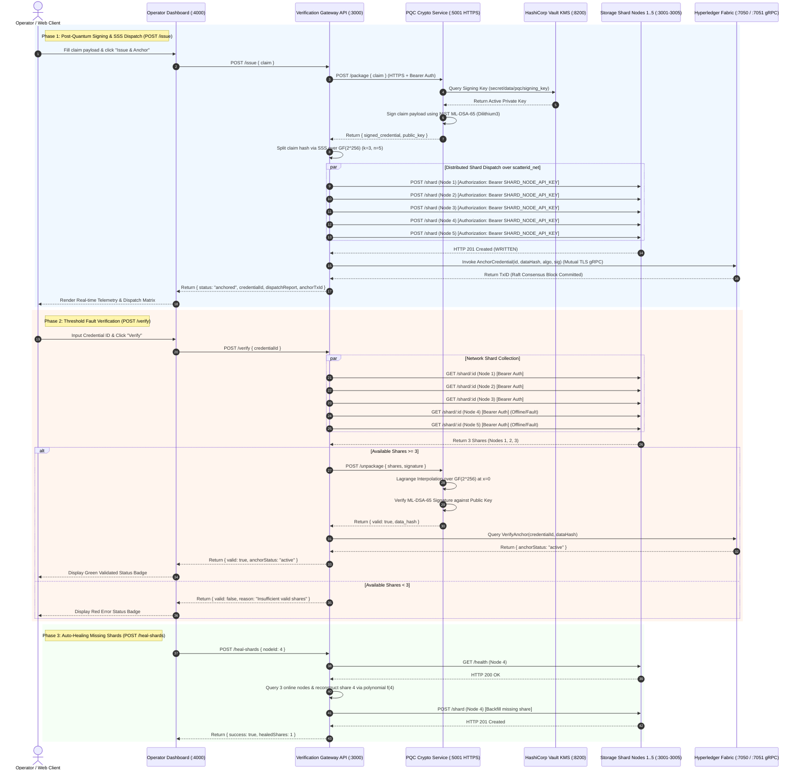

# ScatterID: Decentralized Post-Quantum Identity & Immutable Proof System

ScatterID is an enterprise-grade, post-quantum resilient, threshold-fragmented identity verification platform. It combines **NIST FIPS 204 ML-DSA-65 (Dilithium3)** post-quantum digital signatures with a **Shamir Secret Sharing ($k=3, n=5$)** threshold scheme over Galois Field $GF(2^{256})$, anchored immutably to a multi-node **Hyperledger Fabric** blockchain ledger.

---

## 🏛 System Architecture & End-to-End Communication Protocol



---

## 🏛 Cryptographic Security Guarantees & Boundaries

### 1. Post-Quantum Signature Scheme (ML-DSA-65 / Dilithium3)
- **Standard**: NIST FIPS 204 Standard (Module-Lattice-Based Digital Signature Algorithm).
- **Hardness Basis**: Module Learning With Errors (M-LWE) and Module Short Integer Solution (M-SIS) problems.
- **Security Category**: Category 3 (equivalent to AES-192 hardness against both classical quantum search and Shor's algorithm).
- **Public Key Size**: 1,952 bytes.
- **Signature Size**: 3,309 bytes.
- **Security Property**: EUF-CMA (Existential Unforgeability under Chosen Message Attacks).

### 2. Shamir Secret Sharing over $GF(2^{256})$
- **Polynomial**: $f(x) = a_0 + a_1 x + a_2 x^2 + \dots + a_{k-1} x^{k-1} \pmod{P(x)}$ where $a_0 = S$ (Secret Claim Hash), $k = 3$, $n = 5$.
- **Field Polynomial**: Irreducible Galois Field polynomial $P(x) = x^{256} + x^{10} + x^5 + x^2 + 1$.
- **Information-Theoretic Hardness**: Possessing $k-1 = 2$ shares reveals **0 bits of information** regarding secret $S$. Possession of any $k = 3$ shares enables exact secret reconstruction via Lagrange interpolation:
  $$S = f(0) = \sum_{j=1}^{k} \ell_j(0) \cdot y_j \pmod{GF(2^{256})}$$
  where $\ell_j(x) = \prod_{m \neq j} \frac{x - x_m}{x_j - x_m}$.

### 3. Threshold Fault Resilience & Auto-Healing
- **Fault Threshold**: The system tolerates up to $n - k = 2$ storage node failures (or offline containers) simultaneously without impacting verification capability.
- **Strict Boundary Enforcement**: If 3 or more nodes are offline ($< 3$ reachable HTTP containers), verification fails deterministically with `400 Bad Request` (`"Insufficient valid shares: 2 of 3 required"`).
- **In-Memory Auto-Healing (`POST /heal-shards`)**: Upon node container recovery, online nodes reconstruct missing secret shares via polynomial evaluation $f(\text{nodeId})$ and backfill missing SQLite records.

---

## 🔒 Inter-Service Network Security & Protocol Architecture

All microservice communications within the Docker bridge network (`scatterid_net`) strictly enforce bearer authentication, payload integrity verification, and network isolation:

1. **Bearer Token Authentication**:
   - `SHARD_NODE_API_KEY`: Every request from `verification-api` to `shard-node-1` .. `shard-node-5` must include `Authorization: Bearer <SHARD_NODE_API_KEY>`. Unauthenticated requests are rejected with `401 Unauthorized`.
   - `CRYPTO_SERVICE_API_KEY`: Every request to `crypto-service:5001` enforces TLS 1.3 encryption and Bearer Token header validation.

2. **HashiCorp Vault Key Management (KMS)**:
   - Root keys are provisioned in HashiCorp Vault KV v2 secret engine (`secret/data/pqc/signing_key`).
   - Key rotation requests (`POST /rotate`) dynamically generate new ML-DSA-65 keypairs, persist historical public keys to volume-mounted key history (`/app/data/key_history.json`), and preserve verification validity across all previously issued credentials.

---

## 📁 Repository Structure

```
ScatterID/
├── demo/
│   └── client-portal/          # Next.js Presentation & Marketing Portal (Simulated Sandbox)
├── mvp/
│   └── operator-console/       # Node.js Operator Console & Telemetry Dashboard MVP
├── product/
│   ├── billing-aggregator/     # Billing Aggregator Microservice (Redis queue)
│   ├── blockchain/             # Hyperledger Fabric Network & Go Chaincode
│   ├── crypto-service/         # PQC ML-DSA-65 signing/verification engine
│   ├── shard-node/             # 5 Isolated Containerized SQLite Shard Nodes
│   └── verification-api/       # Verification Gateway API & Shamir Secret Sharing
├── docs/                       # Centralized Documentation Folder (System, Demo, MVP, Product)
├── scripts/                    # Command-line helper and orchestration scripts
│   ├── check_deps.sh           # Dependency audit and setup script
│   ├── start.sh                # Startup & Fabric Orchestration manager
│   ├── test_all.sh             # E2E Integration & Cryptographic Test Suite
│   └── test_fault_tolerance.sh # Fault-Tolerance verification suite
├── docker-compose.yml          # Multi-Container Topology Orchestration
```

---

## ⚡ Quick Start & Verification

### 1. Launch the Stack
```bash
docker compose up -d --build
```

### 2. Execute Complete E2E Integration Suite
```bash
./scripts/test_all.sh
```

### 3. Access Control Interfaces
- **Operator Presentation Portal**: `http://localhost:4000`
- **Verification Gateway API**: `http://localhost:3000`
- **Post-Quantum Crypto Microservice**: `https://localhost:5001`
